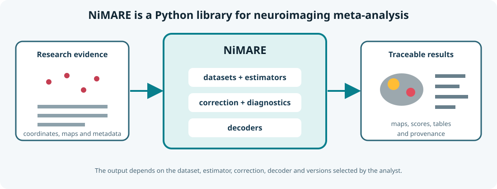

# Meta-analytic decoding

Meta-analytic decoding relates a brain map to terms or topics extracted from a large neuroimaging literature. CALMaR can use this as an exploratory bridge between spatial results and published functional associations.

## Forward and reverse questions

- **Forward inference:** where does the literature report activity for a selected task or term?
- **Reverse decoding:** which terms are statistically associated with a supplied brain map?

These are not interchangeable. Reverse decoding is especially vulnerable to overinterpretation when base rates, study selection, and correlated terms are ignored.

## What the output represents

A decoding score summarises an association between the supplied map and a literature-derived term map under a particular method and database version.

It does not establish that the patient:

- Performed the task represented by the term
- Has an impairment named by the term
- Uses the same functional organisation as the aggregated studies
- Should receive a therapy associated with that term

## CALMaR wording

Technical caution is only part of responsible wording. Reports should also avoid **ableism**: language that treats disability or communication difference as evidence of lesser competence, agency, value, or quality of life. A statistical term returned by a decoder must not become a label for the person.

Respectful language should still be simple and direct. Long, heavily qualified sentences can make important information inaccessible—particularly in a project concerned with acquired communication disorders. Directness and respect are not opposites.

Useful writing rules include:

- Put one main claim in each sentence.
- State what was measured before explaining what it might mean.
- Separate the result, uncertainty, and possible clinical relevance.
- Use *person*, *participant*, or the person's preferred language rather than reducing someone to a lesion or diagnosis.
- Do not infer intelligence, decision-making capacity, motivation, or quality of life from a communication impairment.
- Prefer concrete descriptions of activity and participation over broad deficit labels.
- Preserve technically necessary terms, but define them the first time they appear.

Prefer language such as:

> The affected map overlaps literature-derived spatial associations for these terms.

Or, when reporting to a broader audience:

> This brain map overlaps areas that research studies have associated with these functions. It does not show which abilities this person can or cannot use.

Avoid language such as:

> The scan predicts that the patient has these deficits.

## Implementation information to retain

- Source database and version
- Included study domain
- Decoding algorithm
- Input map and space
- Thresholding and masking
- Score definition
- Multiple-comparison or ranking approach
- Whether the output is exploratory

## NiMARE

[NiMARE](https://nimare.readthedocs.io/)—the **Neuroimaging Meta-Analysis Research Environment**—is an open-source Python library for coordinate-based and image-based meta-analysis, functional decoding, correction, and diagnostics. It is a software library rather than a single analysis: the result depends on the dataset, estimator, decoder, correction method, and parameters selected.

<figure class="calmar-figure" markdown>

<figcaption><strong>Figure 1. What NiMARE provides.</strong> NiMARE organizes research datasets and meta-analytic methods, then returns maps and structured results that retain their analytic provenance. This original schematic summarizes the software described by <a href="https://doi.org/10.52294/001c.87681">Salo et al. (2023)</a>; see the <a href="https://nimare.readthedocs.io/">documentation</a> and <a href="https://github.com/neurostuff/NiMARE">source repository</a>.</figcaption>
</figure>

CALMaR contributors should understand the selected decoder and its assumptions rather than treating a returned term list as self-validating.
