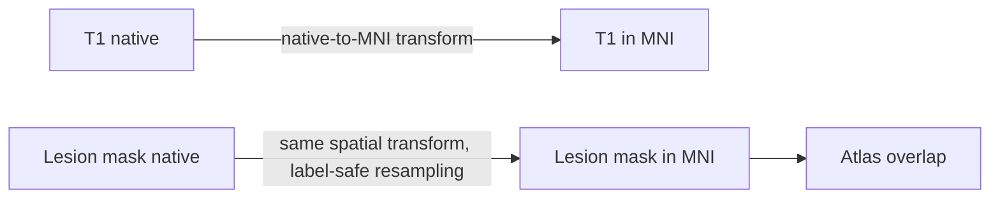

# Images as spatial data

A neuroimaging file contains an array and a mapping from array indices to physical space. Both are necessary.

## Voxels and world coordinates

An array index such as `(40, 62, 31)` identifies a voxel in storage order. It does not identify a brain location until the image affine maps that index into physical coordinates.

```text
voxel index  -- affine -->  physical coordinate
```

Two images can have identical dimensions but different orientations, voxel sizes, origins, or fields of view. Conversely, images with different arrays can represent the same anatomy after a valid transform.

## Spaces used in CALMaR

- **Native space:** the geometry of an individual's acquired image.
- **Template space:** a standard reference such as MNI space.
- **Atlas space:** the grid and coordinate system in which an atlas is distributed.
- **Derived space:** a resampled or transformed grid created by the workflow.

Every derivative should identify its space and the transform chain that produced it.

## Registration and resampling

**Registration** estimates how one image maps to another. **Resampling** evaluates image values on the destination grid. They are related but not identical operations.

Interpolation must match the data:

| Data | Typical interpolation concern |
|---|---|
| Continuous anatomical intensity | Linear or higher-order interpolation may be appropriate |
| Binary lesion mask | Nearest-neighbour preserves label values; other methods require explicit re-thresholding |
| Label atlas | Nearest-neighbour avoids inventing label numbers |
| Probability map | Continuous interpolation may be acceptable if documented |

## Left and right

Left-right errors can produce plausible-looking images and invalid conclusions. File names, visual appearance, array axes, and display conventions are insufficient checks on their own. Orientation should be derived from spatial metadata and verified using known landmarks or trusted reference data.

## Transform chains

Avoid anonymous resampled files. Record the source image, destination image, transform, interpolation, software version, and parameters.



## Guardrails worth implementing

- Assert the expected space before combining volumes.
- Verify dimensions, affine, voxel size, and orientation.
- Keep masks discrete after transforms.
- Save transforms and provenance.
- Test left-right orientation explicitly.
- Include representative damaged brains in regression tests.
- Fail loudly when metadata are missing or inconsistent.

## Recurring misconception

Resizing a three-dimensional image to the array shape expected by a model is not equivalent to anatomically registering it to a template.
