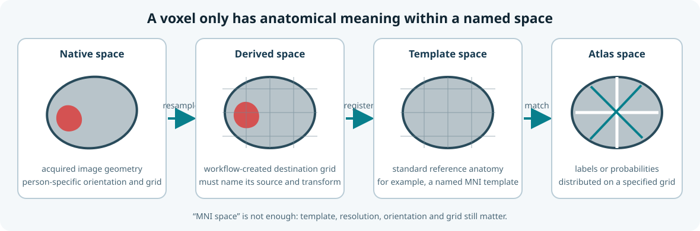
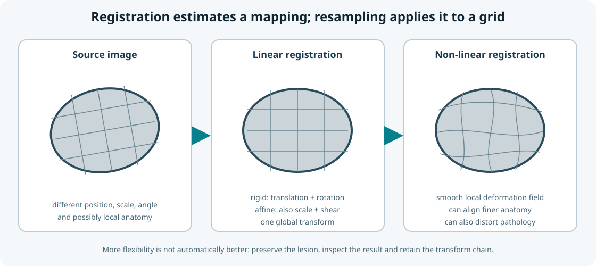
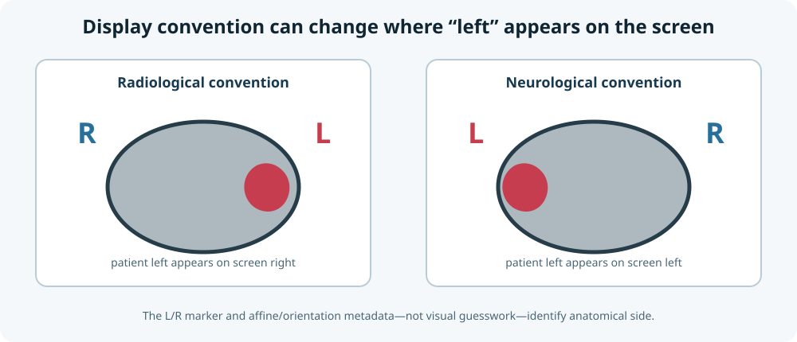
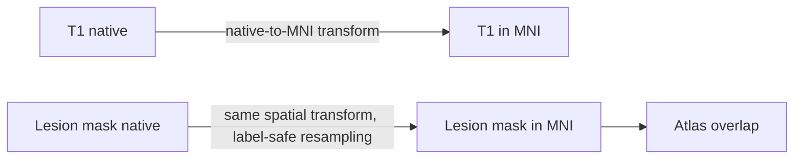

# Images as spatial data

A neuroimaging file contains an array and a mapping from array indices to physical space. Both are necessary.

## Voxels and world coordinates

An array index such as `(40, 62, 31)` identifies a voxel in storage order. It does not identify a brain location until the image affine maps that index into physical coordinates.

```text
voxel index  -- affine -->  physical coordinate
```

Two images can have identical dimensions but different orientations, voxel sizes, origins, or fields of view. Conversely, images with different arrays can represent the same anatomy after a valid transform.

## Spaces used in CALMaR

- **Native space:** the geometry of an individual's acquired image.
- **Template space:** a standard reference such as MNI space.
- **Atlas space:** the grid and coordinate system in which an atlas is distributed.
- **Derived space:** a resampled or transformed grid created by the workflow.

Every derivative should identify its space and the transform chain that produced it.

<figure class="calmar-figure" markdown>

<figcaption><strong>Figure 1. Spaces encountered in CALMaR.</strong> Native space belongs to the acquired image; derived space is any workflow-created destination grid; template space supplies standard reference anatomy; atlas space contains labels or probabilities on a specified grid. This is an original schematic.</figcaption>
</figure>

## Registration and resampling

**Registration** estimates how one image maps to another. **Resampling** evaluates image values on the destination grid. They are related but not identical operations.

Registration can use different transformation families:

- **Rigid registration** translates and rotates an image. It preserves size and shape.
- **Affine registration** adds global scaling and shearing. It is often grouped with rigid registration under the informal label *linear registration*.
- **Non-linear registration** estimates a spatially varying deformation field. It can align finer anatomical differences, but its flexibility can also distort lesions or compensate for pathology in undesirable ways.

The choice depends on the biological question, source and target images, and intended downstream analysis. More flexible registration is not automatically more accurate. The transformed image, lesion boundaries, deformation field, and inverse transform should be checked where applicable.

<figure class="calmar-figure" markdown>

<figcaption><strong>Figure 2. Linear and non-linear registration.</strong> Rigid and affine methods apply one global transform; non-linear methods allow local deformation. Resampling then evaluates image or label values on the destination grid. This is an original schematic.</figcaption>
</figure>

Interpolation must match the data:

| Data | Typical interpolation concern |
|---|---|
| Continuous anatomical intensity | Linear or higher-order interpolation may be appropriate |
| Binary lesion mask | Nearest-neighbour preserves label values; other methods require explicit re-thresholding |
| Label atlas | Nearest-neighbour avoids inventing label numbers |
| Probability map | Continuous interpolation may be acceptable if documented |

## Left and right

We discuss left and right because neuroimaging software can display the same axial image using different conventions. In **radiological convention**, patient left commonly appears on the viewer's right. In **neurological convention**, patient left appears on the viewer's left. Storage order adds another layer: the first array axis is not inherently anatomical left-to-right.

This matters especially in communication disorders because many anatomical and functional interpretations are lateralised. A left-right flip can create a technically plausible but anatomically false atlas overlap, lesion report, or language-network interpretation.

File names, visual appearance, array axes, and display convention are insufficient checks on their own. Anatomical side should be derived from the affine and orientation metadata, then verified using explicit L/R markers, known landmarks, acquisition metadata, or trusted reference data.

<figure class="calmar-figure" markdown>

<figcaption><strong>Figure 3. Why an explicit “L” matters.</strong> The same patient-left lesion can appear on opposite sides of the screen under radiological and neurological display conventions. Orientation metadata is authoritative; this original schematic is not a clinical image.</figcaption>
</figure>

## Transform chains

Avoid anonymous resampled files. Record the source image, destination image, transform, interpolation, software version, and parameters.



<p class="figure-caption"><strong>Figure 4. A recorded transform chain.</strong> Anatomical intensities and label masks can use the same spatial mapping but require interpolation appropriate to their data type.</p>

## Guardrails worth implementing

- Assert the expected space before combining volumes.
- Verify dimensions, affine, voxel size, and orientation.
- Keep masks discrete after transforms.
- Save transforms and provenance.
- Test left-right orientation explicitly.
- Include representative damaged brains in regression tests.
- Fail loudly when metadata are missing or inconsistent.

## Recurring misconception

Resizing a three-dimensional image to the array shape expected by a model is not equivalent to anatomically registering it to a template.
