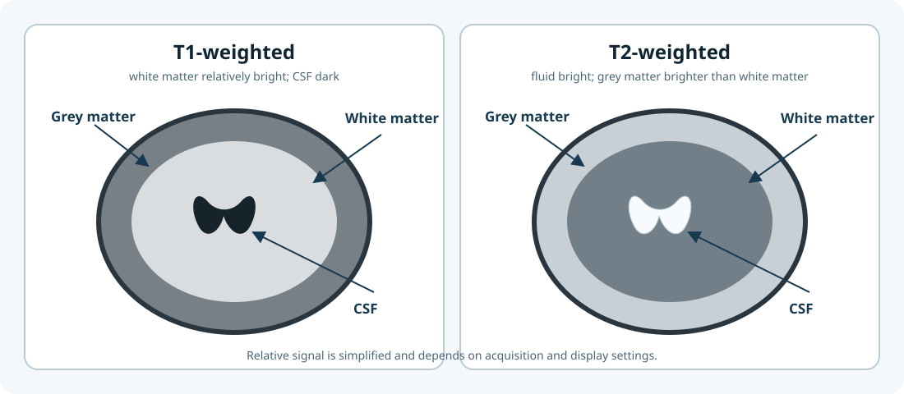
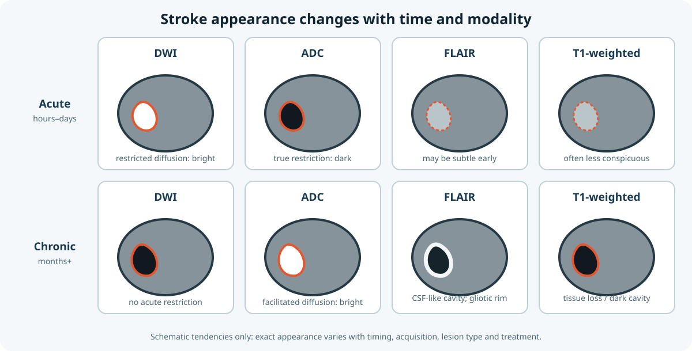

# Why neuroimaging matters to CALMaR

Post-stroke communication profiles arise from more than the total amount of damaged tissue. Location matters, and damage can interrupt white-matter pathways or alter the function of connected regions that appear structurally intact.

CALMaR therefore treats a lesion mask as the beginning of an analysis, not its clinical conclusion.

## Four levels of information

| Level | Question | Example CALMaR output |
|---|---|---|
| Lesion | Which tissue appears directly damaged? | Lesion mask and volume |
| Region | Which labelled anatomical regions overlap the lesion? | Atlas-overlap table |
| Connection | Which pathways or connected regions may be affected? | Tract involvement or disconnectome |
| Evidence | What has research associated with these features? | Citation-linked knowledge-base findings |

Each level adds context, but also adds assumptions. A direct voxel measurement and an inference based on a normative connectome do not have the same evidential status.

## Biology needed for the workflow

### Tissue and fluid

- **Grey matter** contains neuronal cell bodies and local cortical or subcortical circuitry.
- **White matter** contains long-range axonal pathways connecting regions.
- **Cerebrospinal fluid** occupies ventricles and spaces around the brain. Chronic stroke cavities can resemble CSF on some images, which matters for brain extraction and segmentation.

<figure class="calmar-figure" markdown>

<figcaption><strong>Figure 1. Tissue contrast on T1- and T2-weighted MRI.</strong> This original schematic shows common relative signal patterns, not diagnostic images. Signal depends on acquisition and display settings. Concepts are consistent with the MRI overview in <a href="https://doi.org/10.3389/fneur.2013.00060">Huang et al. (2013)</a>.</figcaption>
</figure>

### Time after stroke

Stroke appearance changes over time. Acute restricted diffusion, subacute oedema, and chronic tissue loss do not present the same segmentation problem. Time since stroke must accompany the image and should influence tool selection, quality-control expectations, and interpretation.

<figure class="calmar-figure" markdown>

<figcaption><strong>Figure 2. Schematic evolution of ischaemic stroke across modalities.</strong> Acute restricted diffusion is commonly bright on DWI with a corresponding low ADC; chronic injury may show tissue loss, facilitated diffusion and CSF-like cavitation. Exact appearances vary by timing, acquisition, lesion type and treatment. Original synthesis based on <a href="https://doi.org/10.3389/fneur.2013.00060">Huang et al. (2013)</a> and <a href="https://pmc.ncbi.nlm.nih.gov/articles/PMC5898964/">Imaging of Ischemic Stroke</a>.</figcaption>
</figure>

### Distributed language systems

Language depends on interacting cortical, subcortical, white-matter, sensory, motor, and domain-general systems. An atlas label is a useful coordinate system, not a complete explanation of language function.

<figure class="calmar-figure" markdown>

<figcaption><strong>Figure 3. Distributed systems supporting language.</strong> This is an original conceptual synthesis, not a reproduction of either paper's figure. It combines the dorsal–ventral account of <a href="https://doi.org/10.1038/nrn2113">Hickok and Poeppel (2007)</a> with the distinction between the core language-selective network and interacting perceptual, motor and broader cognitive systems discussed by <a href="https://doi.org/10.1038/s41583-024-00802-4">Fedorenko, Ivanova and Regev (2024)</a>.</figcaption>
</figure>

## Three distinctions to preserve

1. **Damaged tissue versus impaired function.** Structural damage can disrupt function locally and remotely.
2. **Association versus individual prediction.** Group evidence can inform an interpretation without determining an individual outcome.
3. **Biological recovery versus observed outcome.** Therapy access, dosage, comorbidities, environment, goals, and measurement choices also shape the outcome that appears in a dataset.

## Why this matters to engineers

An implementation can be computationally correct and scientifically invalid. Examples include applying an acute-stroke segmenter to unsupported chronic data, silently flipping left and right, using linear interpolation on a label mask, or describing a normative network map as the patient's measured connectivity.

The purpose of this guide is to make those errors visible before they reach a report.
