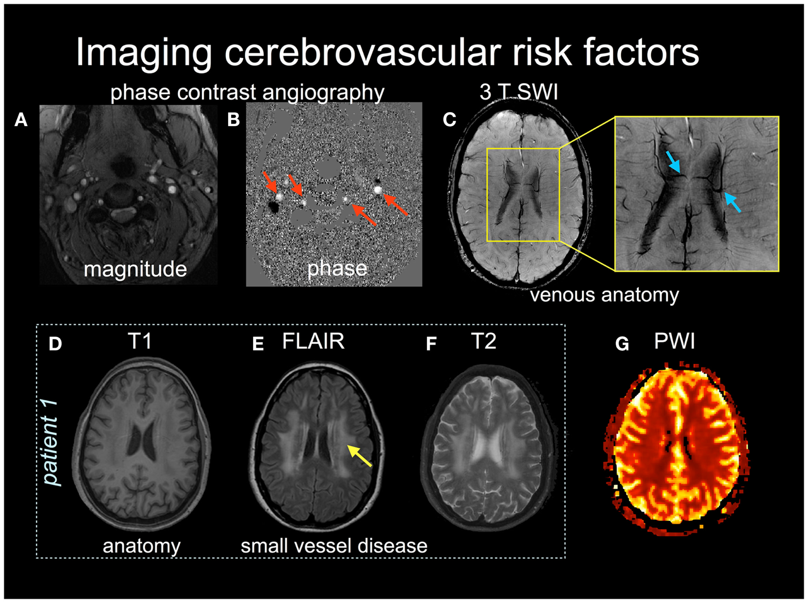
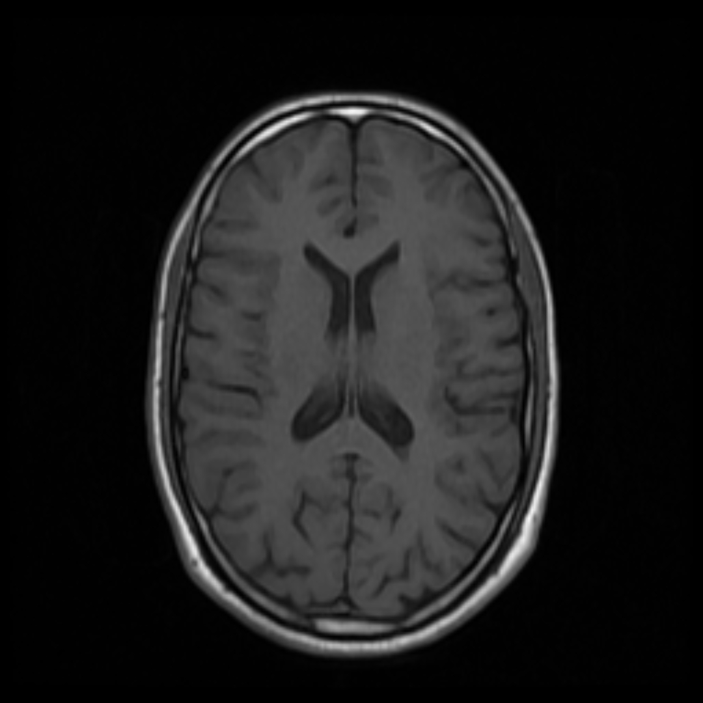
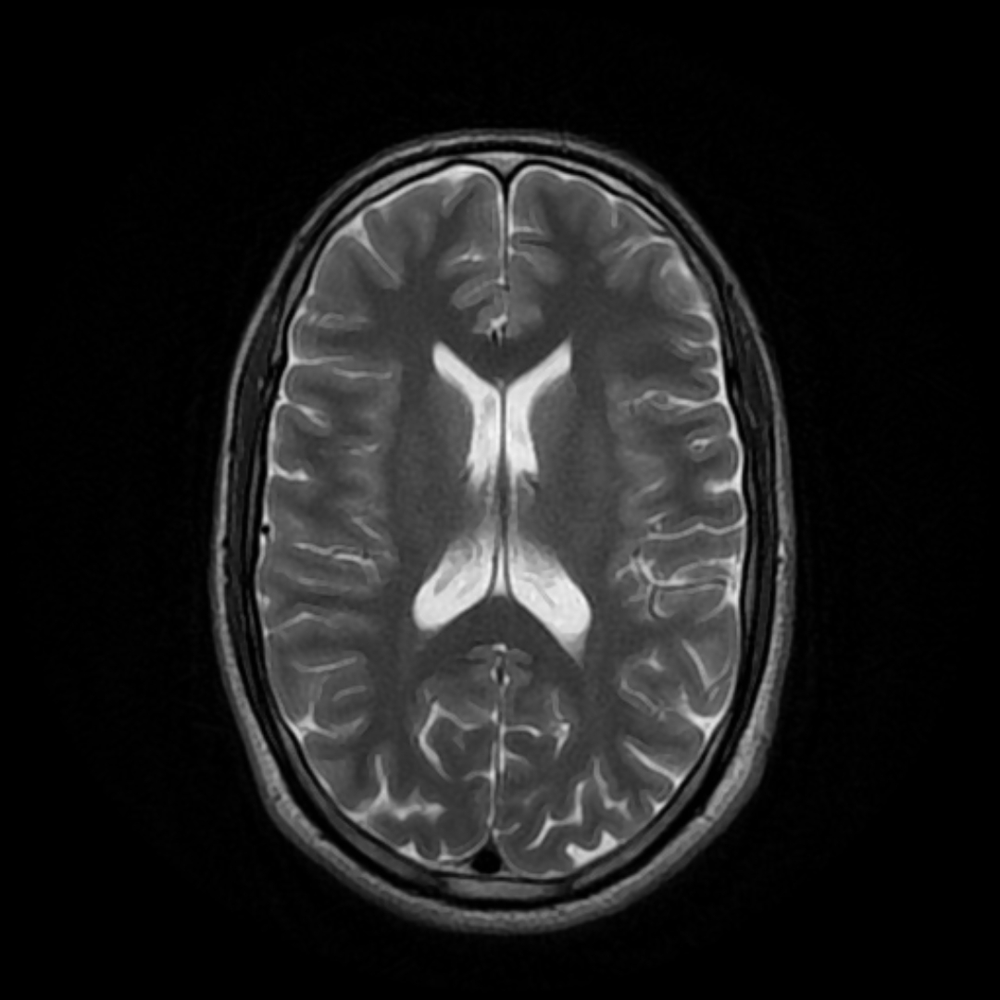
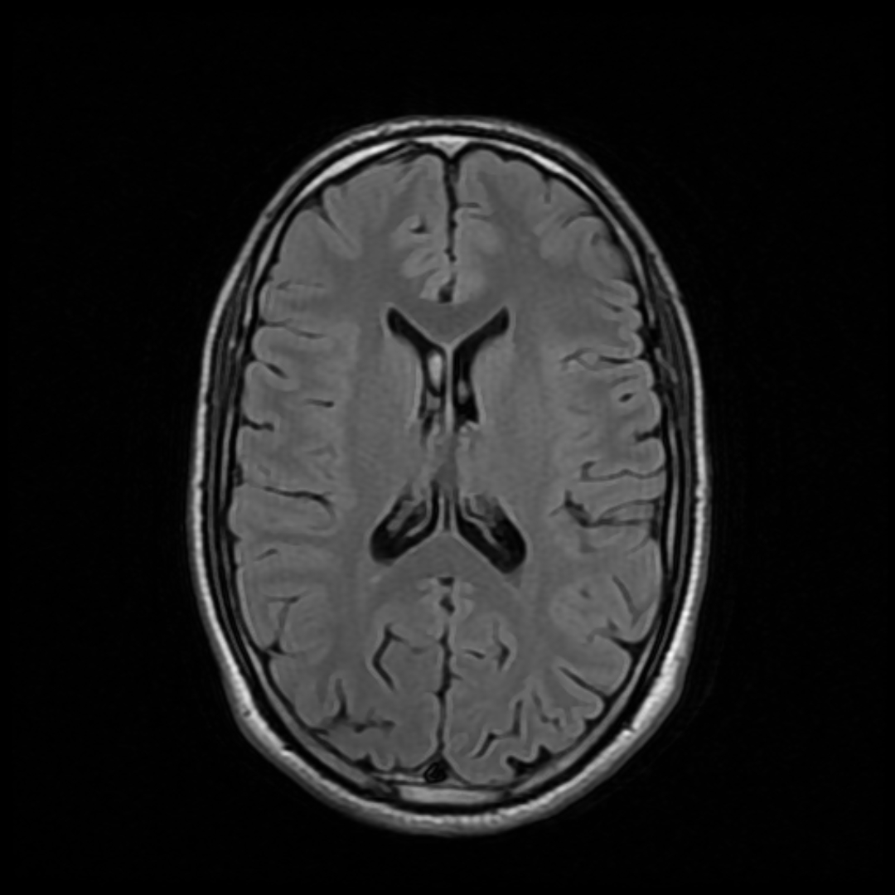
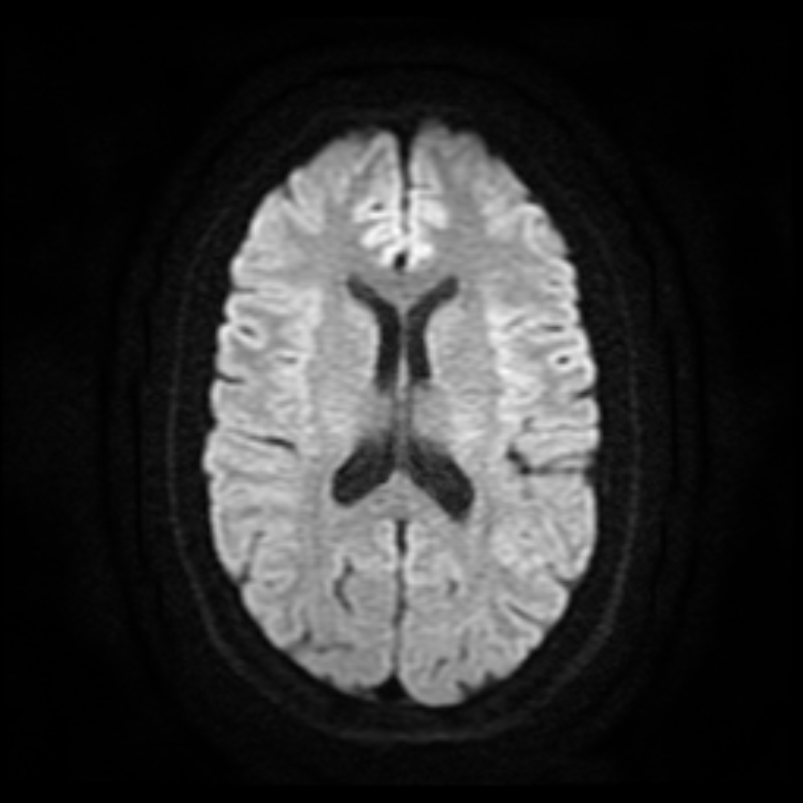
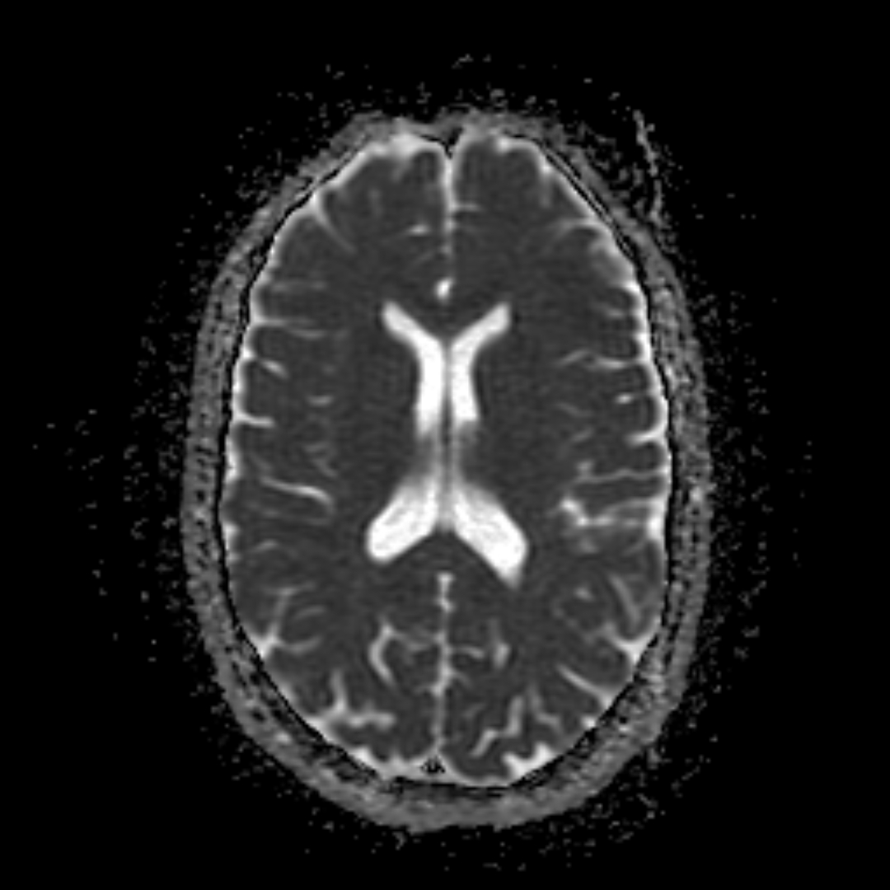
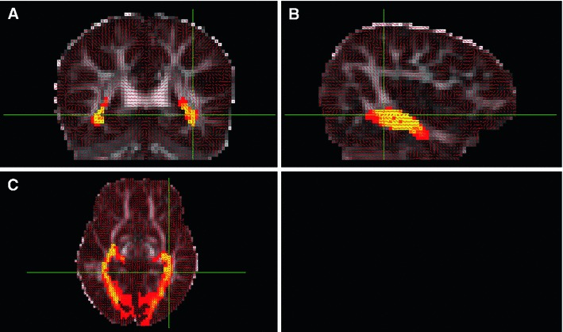
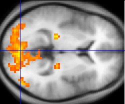
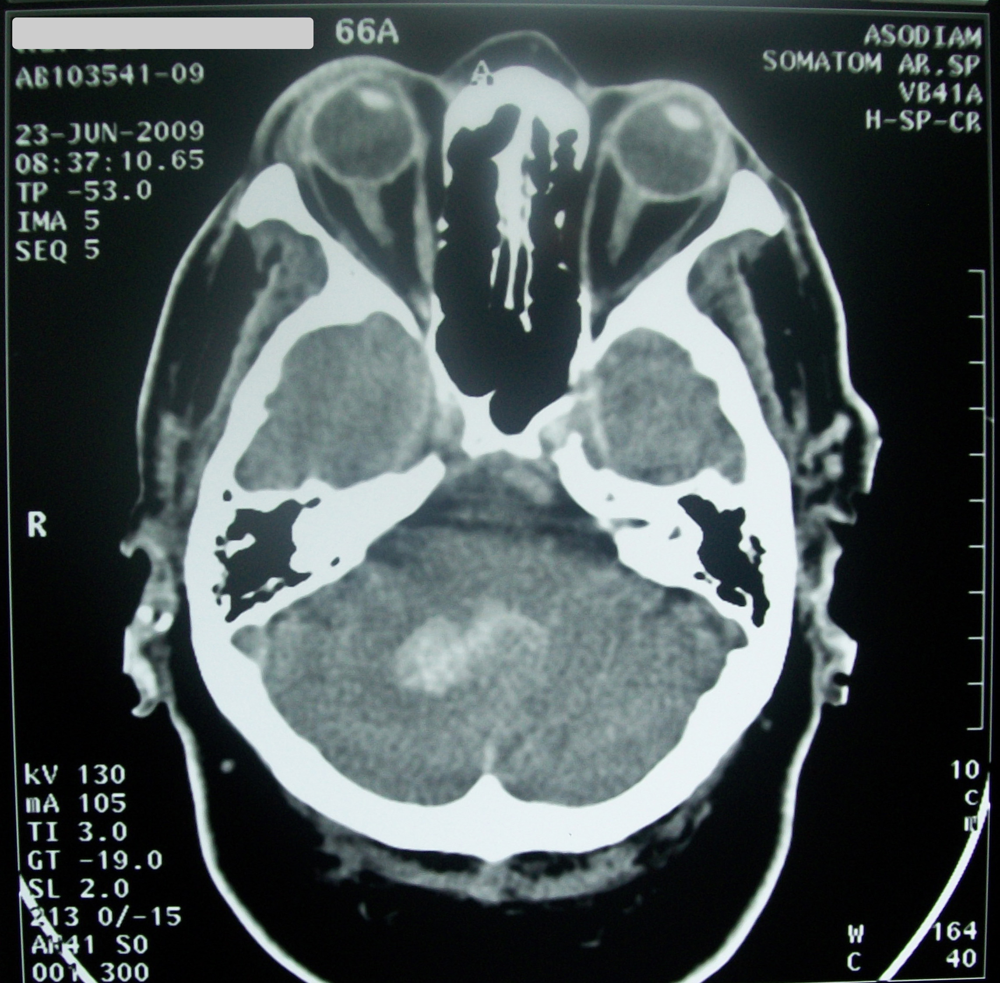

# Images used by CALMaR

MRI is a family of measurements. Different acquisitions emphasise different tissue properties, so an algorithm's required modality is part of its scientific specification.

Contributors do not need to diagnose scans or recognise every sequence by sight. They do need to know what information an input contributes and whether a tool was designed for it.

!!! warning "Image type is not the analysis"
    An image type describes how data were acquired or derived—for example, T1-weighted MRI, DWI, an ADC map, or fMRI. An analysis is what is done with those data—for example, segmentation, registration, tractography, connectivity estimation, atlas overlap, or decoding.

    The same T1-weighted image could support brain extraction, tissue segmentation, registration, morphometry, lesion segmentation, or atlas mapping. Conversely, one analysis may combine several image types. Never infer the analysis solely from the file's appearance or modality label.

<figure class="calmar-figure" markdown>

<figcaption><strong>Figure 1. One label, many MRI contrasts.</strong> These examples include phase-contrast angiography, susceptibility-weighted imaging, T1-weighted MRI, FLAIR, T2-weighted MRI and perfusion-weighted imaging. They illustrate why “an MRI” is not a sufficiently precise input specification. Reproduced from Figure 1 of <a href="https://doi.org/10.3389/fneur.2013.00060">MacIntosh and Graham (2013)</a>, licensed <a href="https://creativecommons.org/licenses/by/3.0/">CC BY 3.0</a>.</figcaption>
</figure>

## CALMaR-relevant image types

| Example | Image type | What it helps show | Why the workflow may use it |
|---|---|---|---|
| { .modality-thumb } | T1-weighted MRI | Anatomical structure and tissue boundaries | Chronic-lesion segmentation, brain extraction, registration, atlas mapping |
| { .modality-thumb } | T2-weighted MRI | Water-sensitive tissue contrast; fluid is usually bright | Complementary lesion information and white-matter abnormality context |
| { .modality-thumb } | FLAIR MRI | T2-like contrast with free-fluid signal suppressed | Making many lesions and white-matter abnormalities conspicuous near CSF |
| { .modality-thumb } | Diffusion-weighted imaging | Restricted water diffusion | Detecting acute ischaemic injury |
| { .modality-thumb } | Apparent diffusion coefficient | Quantified diffusion signal | Interpreting whether DWI hyperintensity reflects true restriction |
| { .modality-thumb } | Diffusion MRI | Direction-dependent diffusion | Modelling white-matter organisation and structural connectivity |
| { .modality-thumb } | Functional MRI | Blood-oxygenation changes related to neural activity | Research on task activity and functional networks |
| { .modality-thumb } | CT | Tissue density and blood | Common acute clinical imaging, requiring modality-specific processing |

<strong>Table 1. CALMaR-relevant image types.</strong> These are real images, included to show that the inputs look materially different—not as a sequence-recognition or diagnostic test. Sources and licences are listed in <a href="../../image-credits/">image credits</a>.

## Inputs are not interchangeable

Changing the input modality changes the statistical appearance of tissue and pathology. A model trained on chronic T1-weighted scans has not automatically learned acute DWI, FLAIR, or CT.

Before connecting a tool, record:

- Supported modalities and required combinations
- Stroke type and time window represented in development data
- Expected dimensionality, voxel spacing, orientation, and intensity handling
- Whether the tool returns probabilities, labels, or both
- Preprocessing included in the tool versus required upstream

## Multimodal inputs

Multiple images from the same person can offer complementary information, but they must be aligned. A DWI volume, ADC map, FLAIR image, and T1 image may have different grids, distortions, coverage, and spatial resolution.

The workflow must know which image defines the reference space and must preserve every transform used to align the others.

## What image brightness does not mean

MRI intensity is generally not a universal physical scale. Brightness can vary with acquisition settings, reconstruction, scanner, coil, preprocessing, and display window. Code should not assume that the same numeric intensity has the same biological meaning across arbitrary scans unless a method explicitly establishes that relationship.

## Practical rule

Treat the modality, acquisition context, time since stroke, and spatial metadata as part of the input. The voxel array alone is incomplete.
