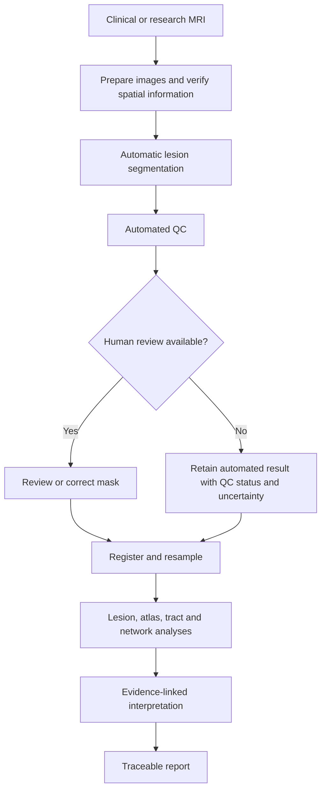

# Understanding neuroimaging for CALMaR

CALMaR connects neuroimaging tools into a reproducible workflow for stroke lesion mapping and clinically interpretable reporting. This guide explains the concepts needed to work on that workflow without turning every contributor into a radiologist or neuroimaging methodologist.

The focus is practical: what each processing stage contributes, what its outputs mean, which assumptions can break, and how errors affect later analyses.

!!! info "Scope"
    This guide supports development and research. CALMaR outputs require appropriate quality control and clinical interpretation. Associations derived from atlases, normative data, or published groups do not establish an individual patient's diagnosis, prognosis, or ideal treatment.

## CALMaR at a glance

Human review can improve confidence and provide a corrected or reference mask, but the workflow must remain capable of producing an explicitly qualified result when no human-traced mask is available.

## Start where the work takes you

-   **I am new to neuroimaging**

    Start with [why neuroimaging matters](foundations/index.md), then learn about [the images used by CALMaR](foundations/mri-inputs.md).

-   **I am working on preprocessing**

    Read [images as spatial data](foundations/image-data.md) and the [workflow overview](workflow/index.md).

-   **I am working on lesion masks**

    Go to [automatic lesion segmentation](workflow/segmentation.md) and [quality control](workflow/quality-control.md).

-   **I am implementing an analysis**

    Compare [atlas overlap](analyses/atlas-overlap.md), [disconnection](analyses/disconnection.md), and [meta-analytic decoding](analyses/decoding.md).

-   **I am interpreting an output**

    Read [clinical interpretation](interpretation.md) before translating a result into language about impairment, recovery, or therapy.

-   **I keep hearing the same question**

    Check the [recurring questions](faq.md), then add a new one through the repository issue template if it is missing.

## Authoritative project sources

- [CALMaR repository](https://github.com/micmas/calmar) for the current notebooks, code, QC rubric, knowledge base, and changing implementation details
- [Lesion interpretation notebook](https://github.com/micmas/calmar/blob/main/lesion-interpretation-pipeline.ipynb) for the implemented workflow
- [Lesion segmentation benchmark](https://github.com/micmas/calmar/blob/main/lesion-segmentation-benchmark.ipynb) for the current tool comparison and benchmarking outputs
- [NeurodeskEDU](https://neurodesk.org/edu/intro.html) for general tutorials and executable neuroimaging examples

This guide explains stable concepts. When a tool, version, threshold, or benchmark result changes, CALMaR itself remains the source of truth.
