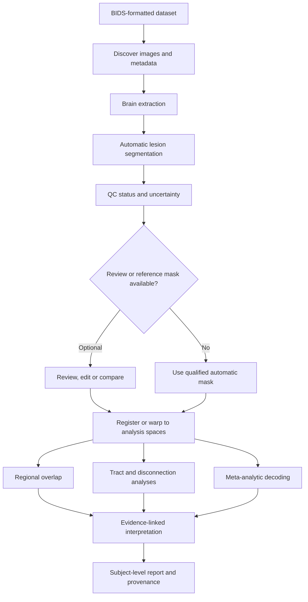

# CALMaR workflow

CALMaR orchestrates existing tools and converts their outputs into traceable analyses. Its scientific validity depends on the contracts between stages as much as on the tools themselves.

## The processing chain

<strong>Figure 1. Conceptual CALMaR processing chain.</strong> Each arrow is a data contract: the downstream stage depends on the type, space, provenance and quality status produced upstream. Human input remains conditional.

## Stage contracts

Each stage should declare:

- Required inputs, including modality and space
- Expected output type and space
- Tool and version
- Parameters and thresholds
- Known limitations
- Quality-control result
- Whether failure stops downstream processing

## Human input is conditional

The primary workflow uses automatic lesion segmentation. An expert or manually traced mask may be available for validation, comparison, correction, or research benchmarking, but it is not a required input for every case.

When no human review is available, the workflow should preserve the automatic mask, attach machine-readable QC information and uncertainty, and avoid presenting downstream results with stronger confidence than the segmentation supports.

## Failures propagate

A poor brain extraction can distort lesion segmentation. A poor segmentation can distort atlas overlap. A registration error can make every regional or network analysis anatomically wrong while leaving the software pipeline technically successful.

For that reason, quality-control status should travel with the data rather than being displayed once and discarded.

## Current implementation

The [CALMaR interpretation notebook](https://github.com/micmas/calmar/blob/main/lesion-interpretation-pipeline.ipynb) is the authority for the implemented sequence of operations. This guide explains why those operations matter; it does not mirror changing cells, versions, or thresholds.
