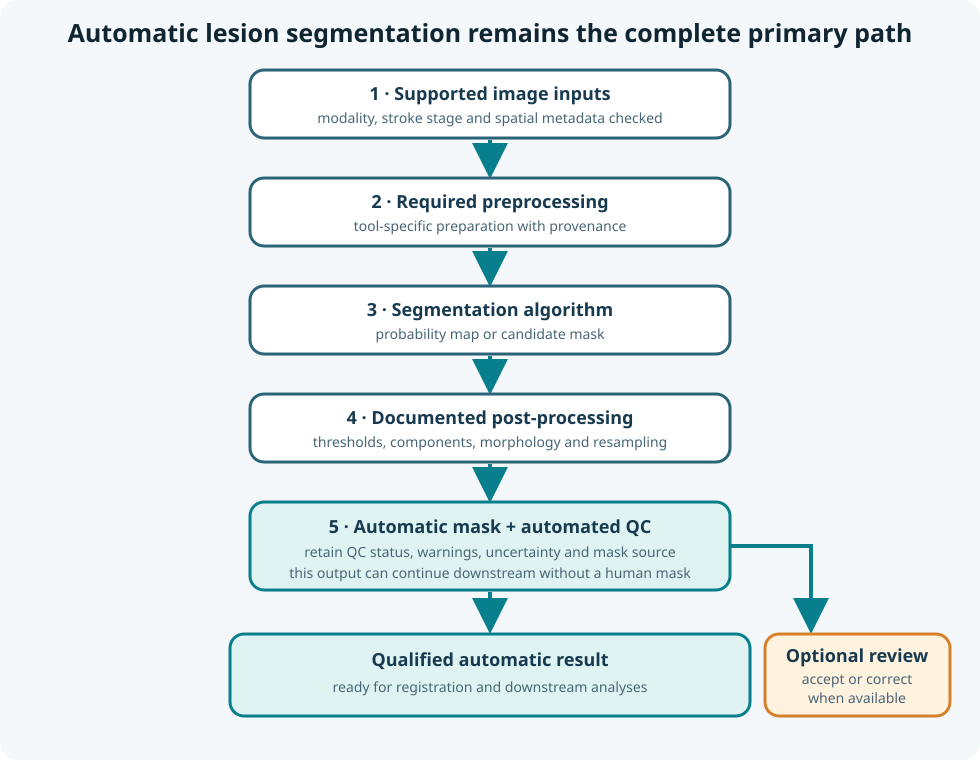

# Automatic lesion segmentation

Lesion segmentation assigns each voxel to lesion or non-lesion, often by first estimating a lesion probability. The resulting mask becomes the spatial basis for most later CALMaR analyses.

## Primary workflow

<figure class="calmar-figure calmar-figure--narrow" markdown>

<figcaption><strong>Figure 1. CALMaR's primary lesion-segmentation workflow.</strong> Supported inputs proceed through documented preprocessing, segmentation, post-processing, automated quality control and uncertainty reporting. Human review can be added when available, but a human-traced mask is not required for the workflow to produce a qualified automatic result. This is an original schematic.</figcaption>
</figure>

CALMaR should work without a human-traced mask. When review is available, it can identify failures, correct a candidate mask, or create a reference for benchmarking. The report must make clear which mask source was used.

## Why segmentation is difficult

Stroke lesions vary in:

- Size, shape, location, and number
- Ischaemic or haemorrhagic origin
- Acute, subacute, or chronic appearance
- Cavitation, oedema, mass effect, and atrophy
- Scanner, protocol, resolution, and artefact
- Coexisting white-matter disease or previous lesions

No performance number removes the need to examine whether the development data match the intended use.

## Tool selection is an empirical question

This guide does not maintain a list of current tools, versions, or rankings. That information changes too quickly and belongs in the [CALMaR lesion-segmentation benchmark](https://github.com/micmas/calmar/blob/main/lesion-segmentation-benchmark.ipynb).

The benchmark should be the source for:

- Which tools are currently evaluated
- Supported modalities and stroke stages
- Dataset-specific performance
- Failure analyses
- Runtime and resource requirements
- Current CALMaR integration status

Stable questions remain useful when assessing any tool:

1. What population and imaging modality were used for development?
2. Which preprocessing is included or assumed?
3. Does the output represent a probability, a binary mask, or multiple labels?
4. How does performance change with lesion size and stroke stage?
5. What happens when the input is outside the development distribution?
6. Can the tool fail detectably, or does it always return a plausible mask?

## Post-processing

Thresholding, connected-component filtering, morphology, hemisphere constraints, and resampling can materially change a mask. Treat these steps as part of the method, not as cosmetic cleanup.

Record the original probability or mask, each operation, its parameters, and the final mask selected for analysis.

## Optional mask sources

CALMaR may encounter several mask sources:

| Mask source | Typical role |
|---|---|
| Automatic candidate | Default scalable workflow |
| Automatically repaired mask | Candidate after documented deterministic operations |
| Human-reviewed automatic mask | Candidate accepted or corrected when expertise is available |
| Expert manual reference | Benchmarking or selected research cases |
| Existing dataset mask | External reference whose creation method must be checked |

Downstream results should identify the source rather than treating every `lesion_mask.nii.gz` as equivalent.

## Validation is downstream-aware

Spatial overlap metrics are necessary but not sufficient. A small missed extension into a tract or critical region can change an atlas or disconnection result while having little effect on whole-mask Dice.

Useful evaluation includes:

- Dice or intersection-over-union
- Lesion-wise sensitivity for multifocal cases
- False-positive lesion count
- Volume error and bias
- Surface or boundary distance
- Performance stratified by lesion size, location, stage, site, and modality
- Stability of atlas, tract, and interpretation outputs
- Frequency of unusable or review-required results

The benchmark notebook should generate the changing numbers. This page supplies the reasoning needed to interpret them.
